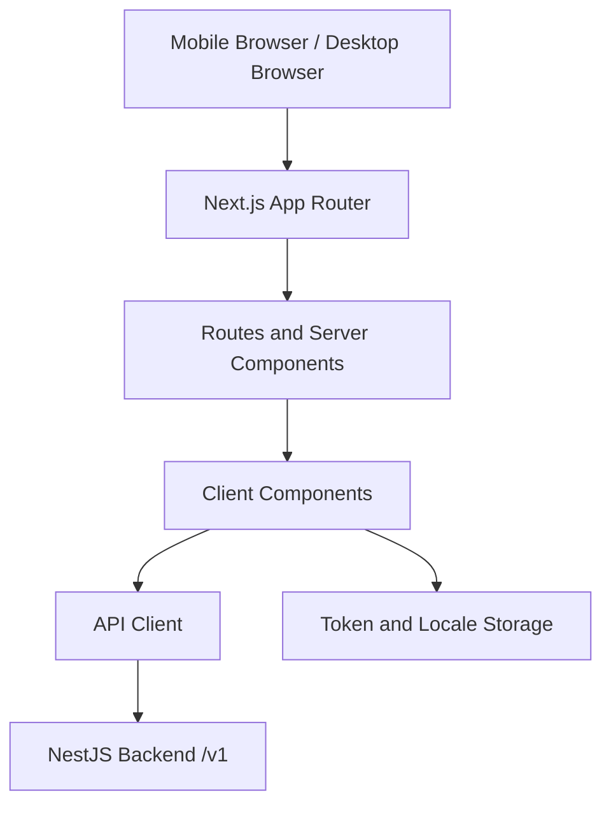

# Design Document: BothSafe Frontend MVP

## Overview

The BothSafe Frontend is a mobile-first Next.js App Router application for creating, joining, and operating Deal Rooms. It is a thin client over the NestJS backend: the backend owns business rules, status transitions, allowed actions, token validation, payment verification, release, refund, and dispute resolution.

The frontend must stay aligned with the backend and Telegram bot specs because the same Deal Room links are opened from web pages, chat apps, and Telegram inline buttons.

## Cross-Layer Alignment Contract

### Shared Deal Status Enum

The frontend SHALL define and render only these status values:

```typescript
export type DealStatus =
  | 'DRAFT'
  | 'AWAITING_COUNTERPARTY'
  | 'AWAITING_BOTH_APPROVAL'
  | 'READY_FOR_PAYMENT'
  | 'PAYMENT_PENDING_VERIFICATION'
  | 'PAID_ESCROWED'
  | 'SELLER_PREPARING'
  | 'SHIPPED'
  | 'BUYER_CONFIRMED'
  | 'DISPUTED'
  | 'RELEASE_PENDING'
  | 'RELEASED'
  | 'REFUNDED'
  | 'CANCELLED'
  | 'EXPIRED';
```

The UI SHALL render the status returned by the API. For operations where the backend performs immediate chained transitions, such as buyer confirmation returning `RELEASE_PENDING`, the UI shows the returned status and uses Timeline events to show that `BUYER_CONFIRMED` happened.

### Link Contract

| Link type | Format | Frontend behavior |
| --- | --- | --- |
| Deal Room | `/d/{publicId}` | Load stored token if available; otherwise show access error or join prompt when invite exists |
| Creator access | `/d/{publicId}?access={accessToken}` | Capture token, store it securely, remove token from visible URL when possible, then load Deal Room |
| Invite | `/d/{publicId}?invite={inviteToken}` | Request safe preview, show join form, submit join request |

Participant API calls SHALL send tokens in `X-Access-Token`. Admin API calls SHALL use `Authorization: Bearer {jwt}`. Raw tokens must never be logged.

### Invite Preview Contract

The join flow calls `GET /v1/deals/{publicId}?invite={inviteToken}` before creating a participant. The preview is intentionally redacted and must not show seller payout information, payment proofs, shipping proofs, dispute evidence, private contact fields, admin notes, or any access token.

The preview response drives:

- Counterparty role label
- Product summary
- Amount and currency
- Missing field checklist for join-relevant fields
- Join action visibility

The join submission sends:

```typescript
{
  invite_token: string;
  role: 'buyer' | 'seller';
  name: string;
  phone?: string;
  preferred_language: 'km' | 'en' | 'zh';
}
```

### Action Contract

The frontend SHALL render primary and secondary Deal Room actions from `allowed_actions` in the API response. It may group and style actions by section, but it must not invent permission rules that bypass the backend.

Expected participant actions:

```typescript
type AllowedAction =
  | 'share_invite_link'
  | 'update_product'
  | 'update_participant'
  | 'update_delivery'
  | 'update_payout'
  | 'approve'
  | 'upload_payment_proof'
  | 'upload_shipping_proof'
  | 'confirm_received'
  | 'open_dispute'
  | 'cancel';
```

### Upload Contract

Payment proofs, shipping proof images, and dispute evidence images SHALL be validated client-side before upload:

- Types: JPEG, PNG, WebP
- Maximum size: 10MB
- Preview before upload
- No upload UI for roles that do not have the corresponding `allowed_actions`

## Architecture



### Application Layers

1. **Routes**: App Router pages for public, deal, and admin views.
2. **API Client**: Typed fetch wrapper with token injection, error mapping, retries, and multipart support.
3. **Domain Types**: Shared TypeScript types for DealStatus, roles, response DTOs, allowed actions, timeline events, and admin objects.
4. **Components**: Reusable UI and Deal Room components.
5. **i18n**: `next-intl` message files for `km`, `en`, and `zh`.

## Route Design

| Route | Rendering | Purpose |
| --- | --- | --- |
| `/` | Public page | Explain escrow and send user to create flow |
| `/deals/new` | Client form | Create buyer-led or seller-led Deal Room |
| `/d/[publicId]` | Server shell plus client Deal Room | Load access/invite query params and render shared Deal Room |
| `/admin` | Server checked public admin login | Admin credential entry |
| `/admin/deals` | Server session required | Admin deal list and filters |
| `/admin/deals/[dealId]` | Server session required | Admin detail, proof review, release/refund |

## API Client Design

The API client reads `NEXT_PUBLIC_API_BASE_URL` and exposes typed methods:

```typescript
interface BothSafeApiClient {
  createDeal(input: CreateDealRequest): Promise<CreateDealResponse>;
  getDeal(publicId: string, opts: AccessOptions): Promise<DealResponse | InvitePreviewResponse>;
  joinDeal(publicId: string, input: JoinDealRequest): Promise<JoinDealResponse>;
  updateSection(publicId: string, section: DealSection, input: unknown): Promise<DealResponse>;
  approve(publicId: string): Promise<DealResponse>;
  uploadPaymentProof(publicId: string, input: FormData): Promise<DealResponse>;
  uploadShippingProof(publicId: string, input: FormData): Promise<DealResponse>;
  confirmReceived(publicId: string): Promise<DealResponse>;
  openDispute(publicId: string, input: FormData): Promise<DealResponse>;
}
```

`AccessOptions` supports:

```typescript
type AccessOptions =
  | { kind: 'participant'; accessToken: string }
  | { kind: 'invite'; inviteToken: string }
  | { kind: 'admin'; jwt: string };
```

Errors are mapped by `message_key` first, then HTTP status, then a generic localized fallback.

## Deal Room Flow

### Create Flow

1. User selects `buyer` or `seller`.
2. Form renders role-specific fields while using backend-compatible DTO names.
3. Frontend validates obvious client errors.
4. `POST /v1/deals` returns creator access URL, invite URL, status, missing fields, and allowed actions.
5. UI warns that the creator link is private and the invite link is shareable.

### Join Flow

1. User opens `/d/{publicId}?invite={inviteToken}`.
2. Frontend requests redacted preview with the invite token.
3. UI shows counterparty role and safe deal summary.
4. User submits name, optional phone, and preferred language.
5. Frontend calls `POST /v1/deals/{publicId}/join`.
6. Returned participant token is stored and the Deal Room reloads as an authenticated participant.

### Deal Operation Flow

All Deal Room sections read from the same `DealResponse`:

- Status card renders `status`
- Product card renders `product`
- Participant cards render buyer/seller public fields and approval state
- Price summary renders `amount`, `fee_amount`, and `net_seller_amount`
- Missing checklist renders `missing_fields`
- Timeline renders backend events
- Primary action bar renders from `allowed_actions`

## Component Map

| Component | Responsibility |
| --- | --- |
| `LanguageSwitcher` | Locale selection and persistence |
| `StatusBadge` | Exact backend status with translated label |
| `DealStatusCard` | Current status, next action, and trust summary |
| `ProductCard` | Product display and product edit entry point |
| `ParticipantCard` | Buyer/seller identity and approval state |
| `PriceSummaryCard` | Amount, fee, net seller payout |
| `EscrowExplanationCard` | Short localized escrow explanation |
| `MissingFieldsChecklist` | Backend missing_fields grouped by section |
| `Timeline` | Event history newest first |
| `PrimaryActionBar` | Sticky mobile action area from allowed_actions |
| `CopyLinkButton` | Invite/private link copying with fallback |
| `ImageUploader` | Shared image validation and preview |
| `ReceiptUploader` | Payment proof upload wrapper |
| `ConfirmDialog` | Confirmation for irreversible actions |
| `DisputeForm` | Dispute reason, message, and evidence upload |

## Admin Design

Admin routes require server-side session checks. The login page is `/admin`; authenticated admins are redirected to `/admin/deals`.

Admin API calls use the backend admin JWT:

- `POST /v1/admin/login`
- `GET /v1/admin/deals`
- `GET /v1/admin/deals/{dealId}`
- `POST /v1/admin/payment-proofs/{id}/verify`
- `POST /v1/admin/payment-proofs/{id}/reject`
- `POST /v1/admin/deals/{id}/release`
- `POST /v1/admin/deals/{id}/refund`
- `POST /v1/admin/disputes/{id}/resolve`

Admin screens may show sensitive proof and payout data that participant screens must hide.

## i18n Design

All visible text uses translation keys. The message files are organized by domain:

```text
messages/
  en.json
  km.json
  zh.json
```

Key namespaces:

- `common`
- `deal`
- `payment`
- `shipping`
- `dispute`
- `admin`
- `errors`

When a backend error includes `message_key`, the frontend maps it to a localized message. Missing translations fall back to English.

## Security and Privacy

- Access tokens are stored in httpOnly cookies when server support exists; otherwise localStorage is allowed for MVP with a visible "keep this link safe" warning.
- The frontend removes `access` query parameters from the visible URL after storing the token.
- No token, admin JWT, payment proof URL, or seller payout KHQR is written to console logs.
- Buyer views never show seller payout KHQR or bank account details.
- Invite previews never show sensitive fields.

## Responsive UX

The primary viewport is a mobile chat-app browser:

- Minimum tap target: 44px
- Sticky bottom action bar on Deal Room pages
- Forms optimized for camera/gallery upload
- Layout supports 320px to 1920px widths
- Admin tables collapse into scannable cards or horizontal scroll on narrow screens

## Validation and Testing Strategy

Frontend tests should verify:

- Status enum coverage in `StatusBadge`
- API DTO parsing and serialization
- Token capture from `access` links and invite preview from `invite` links
- `allowed_actions` rendering without client-only permission bypass
- File validation matches backend-supported types and size
- Confirmation flow renders returned `RELEASE_PENDING` status while Timeline shows buyer confirmation
- Seller payout details remain hidden from buyers and invite previews
