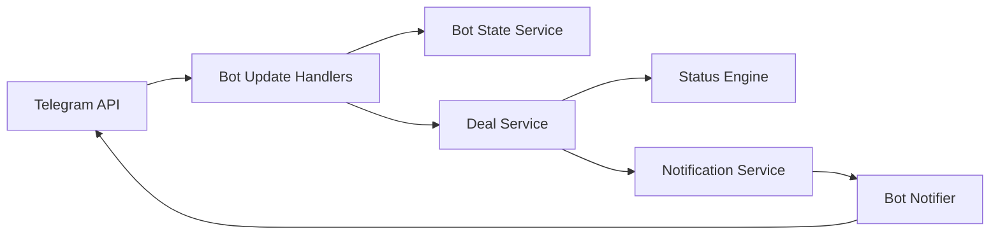

# Design Document: BothSafe Telegram Bot MVP

## Overview

The BothSafe Telegram Bot is a NestJS module inside the backend application. It is not a standalone service. The bot provides quick Deal Room creation, recent deal lookup, localized help, and transaction notifications, while sensitive workflows remain on the web Deal Room.

The bot follows this product boundary:

- Bot creates links and sends notifications.
- Web completes payment proof upload, seller payout setup, shipping proof upload, confirmation, and dispute evidence.
- Backend services own all deal creation, status transitions, audit logs, notifications, and ledger records.

## Cross-Layer Alignment Contract

### Shared Status Contract

The bot SHALL display translated labels for the exact backend status enum:

```typescript
type DealStatus =
  | 'DRAFT'
  | 'AWAITING_COUNTERPARTY'
  | 'AWAITING_BOTH_APPROVAL'
  | 'READY_FOR_PAYMENT'
  | 'PAYMENT_PENDING_VERIFICATION'
  | 'PAID_ESCROWED'
  | 'SELLER_PREPARING'
  | 'SHIPPED'
  | 'BUYER_CONFIRMED'
  | 'DISPUTED'
  | 'RELEASE_PENDING'
  | 'RELEASED'
  | 'REFUNDED'
  | 'CANCELLED'
  | 'EXPIRED';
```

The bot must not create bot-only statuses. If a backend operation performs an immediate chained transition, the bot displays the returned status and may describe the milestone in the message body.

### Shared Service Contract

The bot calls backend services directly through dependency injection:



The bot SHALL pass the same DTO shape as the public API where applicable. It must not duplicate deal creation rules, missing field rules, or status transition rules.

### Link and Token Policy

| Link | Bot behavior |
| --- | --- |
| Creator link `/d/{publicId}?access={token}` | Sent only once to the creator after bot-created deal success |
| Invite link `/d/{publicId}?invite={token}` | Sent only to the creator, optimized for forwarding to the counterparty |
| Deal Room link `/d/{publicId}` | Used for later notifications and `/mydeals` buttons when raw tokens are no longer available |

The bot SHALL never log token-bearing links. The bot SHALL not store raw access tokens in conversation state and SHALL not reconstruct or resend raw access tokens later. This keeps the Telegram spec aligned with the backend token strategy, where raw participant tokens are returned once and only token hashes are stored.

## Module Architecture

### Components

| Component | Responsibility |
| --- | --- |
| `BotModule` | Registers Telegraf integration inside NestJS |
| `BotUpdate` | Handles commands, callbacks, and conversation messages |
| `BotStateService` | Stores short-lived conversation state and retry counters |
| `BotRateLimiterService` | Limits command spam and deal creation |
| `BotTelegramService` | Sends Telegram messages and notification buttons |
| `BotMessages` | Resolves localized bot message keys |
| `BotWebhookGuard` | Validates Telegram webhook secret and production transport constraints |
| `NotificationService` | Emits and dispatches backend events to bot recipients |

### Runtime Modes

| Environment | Update mode | Notes |
| --- | --- | --- |
| Development | Long polling | No public HTTPS endpoint required |
| Production | Webhook | Requires HTTPS URL and webhook secret |

The bot reads configuration from environment variables owned by the backend process.

## Command Design

### `/start`

Flow:

1. Upsert Telegram identity by chat ID.
2. Detect Telegram language and map to `km`, `en`, or `zh`, defaulting to `en`.
3. Send welcome message.
4. Show inline menu: Create Protected Deal, My Deals, Language, Help.
5. Record audit log for new user registration or returning user start.

### `/newdeal`

Flow:

1. Apply command and deal creation rate limits.
2. Clear any existing active deal creation state for the chat.
3. Ask for creator role: seller or buyer.
4. Store conversation state with a 10 minute expiration.
5. Continue through role-specific steps.

Seller steps:

1. Product title
2. Price
3. Optional product type
4. Create deal through `DealService` with `source=telegram`, `creator_role=seller`, `telegram_chat_id`, and language

Buyer steps:

1. Requested product title
2. Expected price
3. Optional note to seller
4. Create deal through `DealService` with `source=telegram`, `creator_role=buyer`, `telegram_chat_id`, and language

After success, the bot sends:

- Deal summary
- Private creator link warning
- Shareable invite link
- Open Deal Room button
- Share Invite Link button

### `/mydeals`

Flow:

1. Query deals where the Telegram chat ID is the creator or a participant.
2. Show the 10 most recent deals.
3. Display product title, amount, status label, and creation date.
4. Add an Open Deal Room button using the tokenless `/d/{publicId}` URL.

Because raw access tokens are not stored, `/mydeals` does not mint or expose a new access token in MVP. Users who need token-based access should use the private link already sent when the deal was created or joined.

### `/help`

The help message explains:

- Buyer pays BothSafe, not the seller.
- Admin verifies payment manually.
- Seller ships after payment is verified.
- Buyer confirms delivery on the web Deal Room.
- Admin releases payout manually.
- Disputes are opened and resolved through the platform.
- Sensitive uploads and payout setup happen on the website.

## Conversation State Design

Conversation state is stored in the backend database:

```typescript
interface BotConversationState {
  telegram_chat_id: string;
  current_flow: 'new_deal';
  creator_role?: 'buyer' | 'seller';
  language: 'km' | 'en' | 'zh';
  step: string;
  product_title?: string;
  amount?: number;
  product_type?: string;
  note?: string;
  retry_count?: number;
  created_at: string;
  expires_at: string;
}
```

Rules:

- Expiration is 10 minutes.
- `/cancel` clears state.
- Starting `/newdeal` clears any old state.
- Expired state is cleaned by a scheduled job.
- The bot validates expected input type for each step.
- Raw access tokens are never stored in state.

## Notification Design

Backend services emit notification events. The notification module creates records and dispatches Telegram messages asynchronously.

| Event | Telegram recipient | Primary message intent |
| --- | --- | --- |
| `COUNTERPARTY_JOINED` | Creator | Counterparty joined; open Deal Room to review |
| `BOTH_APPROVED` | Buyer | Payment can start on website |
| `PAYMENT_VERIFIED` | Seller | Ship product and upload shipping proof |
| `PAYMENT_REJECTED` | Buyer | Upload corrected payment proof |
| `SHIPPING_UPLOADED` | Buyer | Review tracking and confirm or dispute |
| `BUYER_CONFIRMED` | Seller | Release is pending admin action |
| `DISPUTE_OPENED` | Buyer and seller | Admin will review dispute |
| `PAYOUT_RELEASED` | Seller | Payout has been released |
| `REFUND_COMPLETED` | Buyer | Refund has been completed |

All notification buttons include an Open Deal Room URL. Notification failure must not rollback the deal transition.

## Localization Design

The bot uses message keys and language files for `km`, `en`, and `zh`. It shares terminology with the frontend:

- `buyer`
- `seller`
- `Deal Room`
- `payment proof`
- `shipping proof`
- `dispute`
- `release`
- `refund`

If a key is missing, the bot falls back to English and logs a warning without blocking the user flow.

## Security Design

- Bot token is read from environment and never logged.
- Webhook secret is validated for production webhook requests.
- Token-bearing links are redacted from logs and audit metadata.
- Creator links are sent only to the creator chat.
- Invite links are sent only to the creator for manual sharing.
- User text input is sanitized and length-limited before it reaches the Deal Service.
- Rate limits apply per Telegram chat ID.

## Health and Configuration

The backend `/health` endpoint includes bot health by checking Telegram `getMe`. Configuration keys:

- `TELEGRAM_BOT_TOKEN`
- `TELEGRAM_WEBHOOK_URL`
- `TELEGRAM_WEBHOOK_SECRET`
- `BOT_RATE_LIMIT_DEALS_PER_HOUR`
- `BOT_RATE_LIMIT_COMMANDS_PER_MINUTE`
- `BOT_CONVERSATION_TIMEOUT_MINUTES`
- `APP_BASE_URL`

## Validation Checklist

- Bot-created deals use the same Deal Service as web-created deals.
- Bot creation payloads set `source=telegram`.
- Bot and frontend use the same status enum labels.
- Bot notification buttons open the same `/d/{publicId}` Deal Room route used by the frontend.
- Bot never handles payment proof upload, payout KHQR collection, admin release, or automatic payment verification in MVP.
- Bot failures do not rollback backend deal updates.
